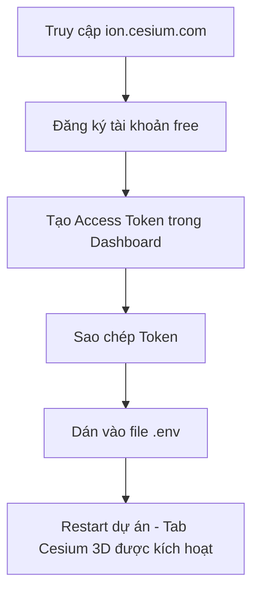

# Sách Hướng Dẫn Vận Hành CSDL & Triển Khai Dự Án (InfraWatch)

Tài liệu này hướng dẫn chi tiết cách cấu hình toàn diện hệ thống bao gồm: kích hoạt địa lý **PostGIS**, tích hợp mô hình AI **`last.pt`** tự đào tạo, và thiết lập bản đồ không gian 3D **CesiumJS** trực quan sinh động.

---

## 1. Cấu Hình Địa Lý PostGIS Cho PostgreSQL

Bạn đã cài đặt PostGIS cho PostgreSQL của mình. Dưới đây là các bước để kích hoạt và di chuyển cấu trúc dữ liệu địa lý trong dự án.

### Bước 1: Kích hoạt tiện ích mở rộng PostGIS trên CSDL
Bạn cần kết nối vào cơ sở dữ liệu `public_infra_db` và khởi chạy tính năng địa lý của PostGIS bằng lệnh SQL:
1. Mở công cụ quản lý cơ sở dữ liệu (DBeaver hoặc pgAdmin 4) và kết nối tới CSDL `public_infra_db` của bạn.
2. Mở một cửa sổ truy vấn SQL (SQL Editor) và chạy lệnh sau:
   ```sql
   CREATE EXTENSION postgis;
   ```
3. Kiểm tra danh sách `Extensions` trong schema, bạn sẽ thấy `postgis` xuất hiện, báo hiệu CSDL đã sẵn sàng xử lý dữ liệu không gian.

### Bước 2: Cấu hình biến môi trường `.env`
Chúng tôi đã chỉnh sửa file cấu hình `.env` gốc để hệ thống local nhận diện và sử dụng PostGIS:
* `USE_POSTGIS=true`: Kích hoạt chế độ địa lý nâng cao.
* `USE_POSTGRES=false`: Tắt chế độ PostgreSQL tiêu chuẩn (để PostGIS kiểm soát kết nối).

### Bước 3: Cơ chế tự động dò tìm thư viện GDAL trên Windows
> [!NOTE]
> Django trên Windows thường gặp khó khăn trong việc định vị các thư viện địa lý (GDAL, GEOS, PROJ) dẫn đến lỗi `ImproperlyConfigured`. 
> Tôi đã triển khai mã nguồn tự động dò tìm thông minh trong [development.py](file:///d:/Development/projects/public-infra-system/backend/core/settings/development.py). 
> Mã này sẽ tự quét các đường dẫn cài đặt PostgreSQL (14, 15, 16) và OSGeo4W trên ổ đĩa máy của bạn để tự động nạp thư viện `gdal.dll` vào hệ thống mà không cần bạn cấu hình thủ công biến môi trường Windows.

### Bước 4: Thực hiện di chuyển bảng (Migrate) & Nạp lại dữ liệu địa lý
Tại thư mục `backend`, hãy chạy các lệnh sau để khởi tạo các trường không gian hình học thực tế (`location` kiểu Point):
```bash
# Thực hiện di chuyển bảng dữ liệu sang PostGIS
venv\Scripts\python manage.py migrate

# Nạp lại dữ liệu mô phỏng demo. Lúc này, tọa độ GPS sẽ được lưu trực tiếp dưới dạng Point không gian thay vì dạng float số thực!
venv\Scripts\python manage.py seed_demo_all
```

---

## 2. Tích Hợp Mô Hình AI Tự Đào Tạo (`last.pt`)

Bạn đã chuẩn bị file weights mô hình AI có tên `last.pt`. Hãy tích hợp theo hướng dẫn sau:

### Bước 1: Vị trí đặt file weights
1. Tìm đến thư mục dịch vụ AI: `public-infra-system/ai-service/`.
2. Tạo thư mục `models` (nếu chưa có) và sao chép (copy) file **`last.pt`** của bạn vào đó.
   * Đường dẫn chính xác: `public-infra-system/ai-service/models/last.pt`

### Bước 2: Cấu hình biến môi trường và nạp mô hình tự động
* Tôi đã cập nhật file `.env` chỉ định đường dẫn mô hình AI mới:
  ```env
  YOLO_MODEL_PATH=models/last.pt
  ```
* Đồng thời, tôi đã bổ sung mã nạp tự động (dotenv loader) trực tiếp trong [ai-service/main.py](file:///d:/Development/projects/public-infra-system/ai-service/main.py) để dịch vụ AI khi chạy local tự động đọc các thiết lập từ file `.env` ở thư mục gốc mà không cần bạn gán biến thủ công trong shell.

Khi bạn khởi chạy dịch vụ AI bằng lệnh:
```bash
cd ai-service
venv\Scripts\activate
python -m uvicorn main:app --port 8001
```
Hệ thống sẽ ghi nhận log nạp mô hình thực tế: `Loaded YOLO model from models/last.pt`. Nếu file không tồn tại hoặc bị lỗi, hệ thống sẽ tự động hạ cấp về chế độ giả lập (`mock mode`) để đảm bảo dịch vụ không bị sập.

---

## 3. Thiết Lập Bản Đồ Không Gian 3D Trực Quan Với CesiumJS

CesiumJS cung cấp bản đồ không gian 3D cao cấp (địa hình, tòa nhà 3D thành phố) chạy song song với Leaflet 2D trong dự án.



### Hướng dẫn chi tiết từng bước:

### Bước 1: Lấy mã Token truy cập miễn phí từ Cesium
1. Truy cập vào trang quản lý của Cesium: [https://ion.cesium.com/](https://ion.cesium.com/).
2. Đăng ký một tài khoản miễn phí (hỗ trợ đăng nhập nhanh bằng tài khoản Google hoặc GitHub).
3. Sau khi đăng nhập, tại trang Dashboard, truy cập vào menu **Access Tokens** nằm ở thanh điều hướng bên trái.
4. Bạn sẽ thấy một token mặc định có sẵn tên là **Default**. Nhấp vào biểu tượng **Copy** (sao chép) bên cạnh dòng token dài đó.

### Bước 2: Khai báo Token vào dự án
Mở file cấu hình `.env` ở thư mục gốc dự án, tìm đến phần CesiumJS và dán token bạn vừa sao chép vào cả 2 dòng:
```env
# CesiumJS (đã dán mã token của bạn)
CESIUM_ION_TOKEN=eyJhbGciOiJIUzI1NiIsInR5cCI6IkpXVCJ9.your-token-here...
VITE_CESIUM_ION_TOKEN=eyJhbGciOiJIUzI1NiIsInR5cCI6IkpXVCJ9.your-token-here...
```

### Bước 3: Vận hành và xem kết quả
Khi khởi động dự án Frontend (`npm run dev`), hệ thống sẽ phát hiện sự hiện diện của `VITE_CESIUM_ION_TOKEN`.
1. Mở trình duyệt truy cập vào dashboard dự án: [http://localhost:5173/](http://localhost:5173/).
2. Bạn sẽ thấy trên thanh công cụ điều hướng bản đồ xuất hiện thêm nút chọn hoặc Tab **Bản Đồ 3D (Cesium)**.
3. Nhấp vào đó, hệ thống sẽ dựng toàn bộ địa hình Đà Nẵng dưới dạng không gian 3-Chiều. Toàn bộ 28 tài sản hạ tầng và các điểm báo cáo sự cố được vẽ dưới dạng các ghim cắm 3D sống động có thể xoay góc nhìn, nghiêng và thu phóng cực kỳ mượt mà.

---

## 4. Hướng Dẫn Xem Trực Tiếp Dữ Liệu SQL & Backup

### Cách xem trực tiếp bảng dữ liệu
1. Mở **DBeaver** -> Kết nối tới PostgreSQL bằng thông số:
   - Host: `localhost` | Port: `5432` | Database: `public_infra_db` | User: `postgres`
2. Truy cập: `public_infra_db` -> `Schemas` -> `public` -> `Tables`.
3. Nhấp đúp vào bảng `incident_reports` hoặc `maintenance_logs` để xem trực tiếp các bản ghi dưới dạng bảng tính.

### Cách xuất (Dump) toàn bộ CSDL ra file `.sql` để bàn giao/chia sẻ
Mở cửa sổ dòng lệnh máy thật (không dùng Docker) và chạy:
```bash
pg_dump -U postgres -h localhost -d public_infra_db --clean --inserts > backup_public_infra.sql
```
Lệnh trên sẽ kết xuất toàn bộ cấu trúc bảng và 100+ bản ghi dữ liệu demo của bạn thành file mã nguồn SQL sạch sẽ có tên `backup_public_infra.sql`.
